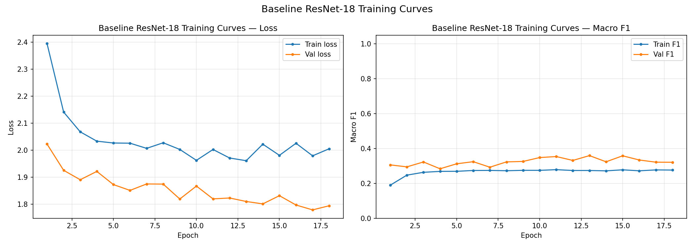
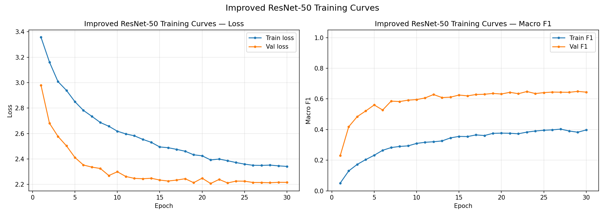
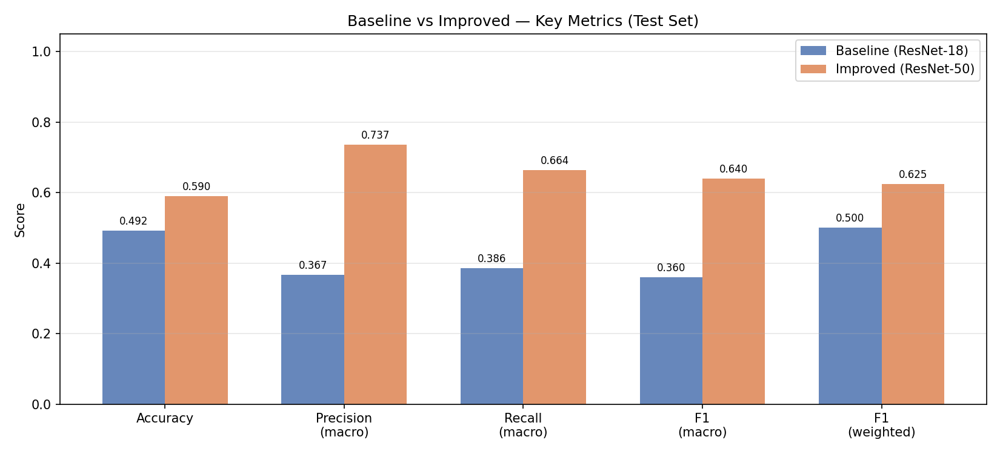
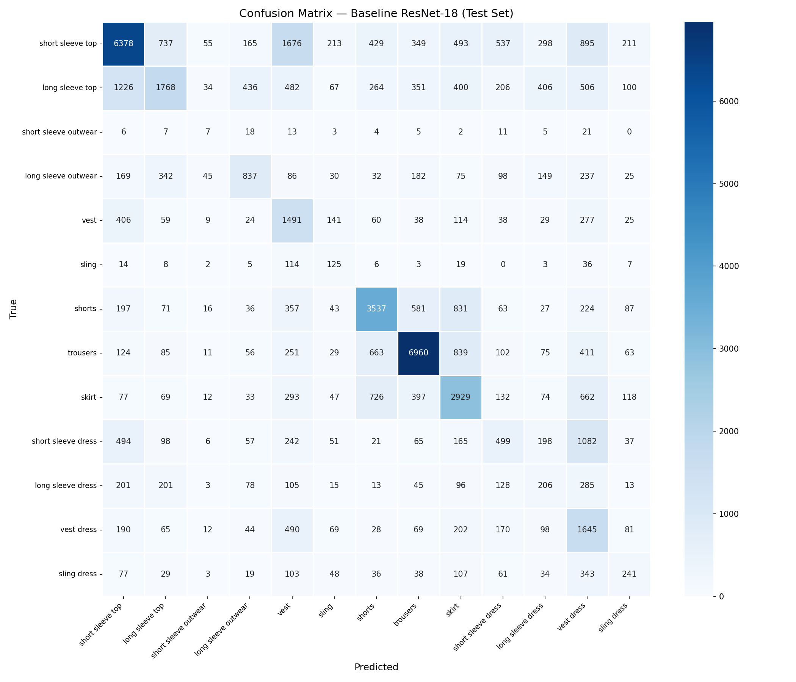
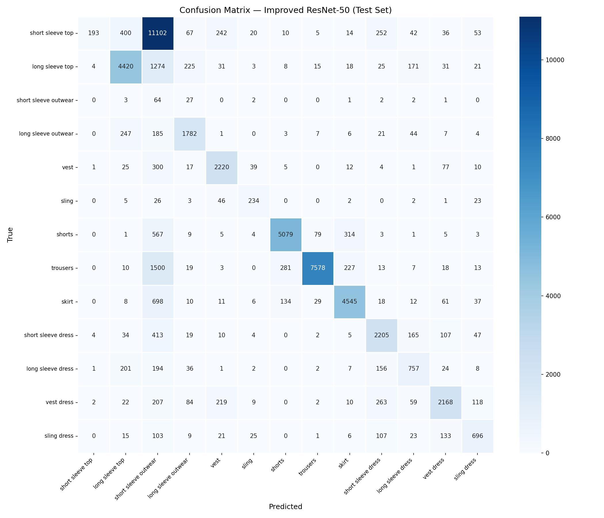
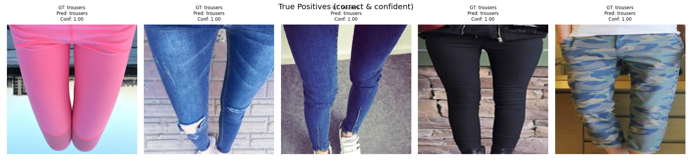
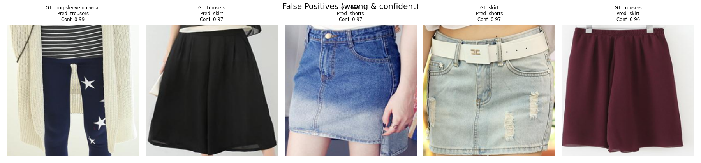

# Clothing Classification System: DeepFashion2

Computer Vision Milestone 2 · ResNet-18 Baseline vs ResNet-50 Improved

---

## Project Overview

This project trains and evaluates two deep learning models for clothing category classification on the **DeepFashion2** dataset (13 categories, ~264K images). All components—data pipeline, training, evaluation, and UI—are modular and reproducible.

| Model | Architecture | Strategy | Key Features |
|-------|-------------|----------|-------------|
| Baseline | ResNet-18 | Frozen backbone | Fixed LR · CrossEntropy · 4 augmentations |
| Improved | ResNet-50 | Full fine-tuning | Cosine LR · Label smoothing · Mixup · Gradual unfreeze |

---

## Project Structure

```
fashion_classification/
│
├── configs/
│   ├── dataset_config.py        # Paths, class names, split ratios, EDA findings
│   ├── baseline_config.py       # All hyperparameters for the baseline model
│   └── improved_config.py       # All hyperparameters for the improved model
│
├── utils/
│   ├── dataset.py               # Dataset class, DataLoaders, stratified split
│   ├── metrics.py               # All metrics, plots, qualitative analysis
│   ├── gradcam.py               # Grad-CAM implementation for ResNet
│   └── logger.py                # Structured logging + epoch JSON logger
│
├── baseline_model/
│   ├── src/
│   │   ├── model.py             # ResNet-18 architecture
│   │   ├── trainer.py           # Training loop with early stopping
│   │   └── evaluate.py          # Full test set evaluation
│   ├── run_baseline.py          # ← Main entry point
│   └── outputs/
│       ├── checkpoints/         # best_model.pth · final_model.pth
│       ├── plots/               # training_curves · confusion_matrix · per_class_f1
│       ├── results/             # metrics.json · per_class.csv · predictions.csv
│       ├── logs/                # training.log · epoch_log.json
│       ├── qualitative/         # true/false positives/negatives · hard cases
│       └── gradcam/             # Grad-CAM overlay PNGs
│
├── improved_model/
│   ├── src/
│   │   ├── model.py             # ResNet-50 architecture + gradual unfreeze
│   │   ├── trainer.py           # Training with mixup, cosine LR, gradient clipping
│   │   ├── hparam_search.py     # Random HP search · LR finder · Ablation study
│   │   └── evaluate.py          # Full test set evaluation
│   ├── run_improved.py          # ← Main entry point
│   └── outputs/
│       ├── checkpoints/         # best_model.pth · final_model.pth
│       ├── plots/               # training_curves · lr_finder · confusion_matrix
│       ├── results/
│       │   ├── hparam_search/   # hp_search_results.json · .csv
│       │   ├── lr_finder/       # lr_finder_data.json
│       │   └── ablation/        # ablation_results.json · .csv
│       ├── logs/
│       ├── qualitative/
│       └── gradcam/
│
├── comparison/
│   ├── compare_models.py        # ← Run after both models complete
│   └── outputs/
│       ├── metrics_comparison.png
│       ├── per_class_f1_comparison.png
│       ├── training_curves_comparison.png
│       └── model_comparison_summary.csv
│
├── ui/
│   └── app.py                   # Gradio app — side-by-side Top-5 predictions
│
├── environment.yml              # Conda environment spec
└── README.md
```

---

## Key Results

### Training Performance

<table>
<tr>
<td></td>
<td></td>
</tr>
<tr>
<td align="center"><b>Baseline Model (ResNet-18)</b></td>
<td align="center"><b>Improved Model (ResNet-50)</b></td>
</tr>
</table>

#### Model Comparison


### Confusion Matrices

<table>
<tr>
<td></td>
<td></td>
</tr>
<tr>
<td align="center"><b>Baseline Model</b></td>
<td align="center"><b>Improved Model</b></td>
</tr>
</table>

### Qualitative Analysis

<table>
<tr>
<td></td>
<td></td>
</tr>
<tr>
<td align="center"><b>True Positives</b></td>
<td align="center"><b>False Positives</b></td>
</tr>
</table>

---

## Setup

### Option A: Local (conda)

```bash
# 1. Clone / download the project
cd fashion_classification

# 2. Create and activate conda environment
conda env create -f environment.yml
conda activate fashion_cv

# 3. Edit DATA_ROOT in configs/dataset_config.py to point to your local dataset
```

### Option B: Kaggle (T4 GPU, recommended)

The Kaggle notebook already has PyTorch + CUDA. Just install extra deps:

```python
# In a Kaggle notebook cell:
!pip install gradio scikit-learn seaborn --quiet
```

Then upload the entire `fashion_classification/` folder as a Kaggle dataset or paste files directly into the notebook's file system.

**Dataset required:** [deepfashion2-original-with-dataframes](https://www.kaggle.com/datasets/thusharanair/deepfashion2-original-with-dataframes)

Add it to your Kaggle notebook via the "Add Data" button. The default `DATA_ROOT` in `configs/dataset_config.py` already points to the Kaggle path.

---

## Training & Evaluation

### Step 1: Train and evaluate the baseline model

```bash
cd baseline_model
python run_baseline.py
```

**Flags:**
- `--skip-training` / `--eval-only` — Load existing checkpoint, run evaluation only

**What this produces:**
- `outputs/checkpoints/best_model.pth` ← used by UI and comparison
- `outputs/plots/training_curves.png`
- `outputs/plots/confusion_matrix_test.png`
- `outputs/plots/per_class_f1_test.png`
- `outputs/results/baseline_metrics.json`
- `outputs/results/baseline_per_class_metrics.csv`
- `outputs/results/baseline_predictions.csv`
- `outputs/results/training_history.csv`
- `outputs/logs/training.log`
- `outputs/logs/epoch_log.json`
- `outputs/qualitative/` — true/false positives/negatives, hard cases
- `outputs/gradcam/` — Grad-CAM overlays (3 examples)

---

### Step 2: Train and evaluate the improved model

```bash
cd improved_model
python run_improved.py
```

**Flags:**
- `--skip-training`    — Skip training, evaluate only
- `--skip-hp-search`  — Skip HP search and LR finder (saves ~30 min)
- `--skip-ablation`   — Skip ablation study (saves ~1 hr)
- `--eval-only`       — Alias for `--skip-training`

**Additional outputs (beyond baseline):**
- `outputs/plots/lr_finder.png`
- `outputs/results/hparam_search/` — HP search results
- `outputs/results/ablation/` — Ablation study results

---

### Step 3: Generate comparison plots

```bash
cd ..   # project root
python comparison/compare_models.py
```

Run this **after** both models are fully evaluated. Produces:
- `comparison/outputs/metrics_comparison.png`
- `comparison/outputs/per_class_f1_comparison.png`
- `comparison/outputs/training_curves_comparison.png`
- `comparison/outputs/model_comparison_summary.csv`

---

### Step 4: Launch the UI

```bash
python ui/app.py
```

Opens Gradio at `http://localhost:7860`. Upload any fashion image to see both models' top-5 predictions side by side.

Set `share=True` in `ui/app.py` to get a public Gradio link (useful for Kaggle demos).

---

## Kaggle Notebook Quickstart

Paste and run these cells in order:

```python
# Cell 1 — Install deps
!pip install gradio scikit-learn seaborn --quiet

# Cell 2 — Train baseline (from project root)
import os
os.chdir('/kaggle/working/fashion_classification/baseline_model')
%run run_baseline.py

# Cell 3 — Train improved (skip HP search to save time on Kaggle)
os.chdir('/kaggle/working/fashion_classification/improved_model')
%run run_improved.py --skip-hp-search --skip-ablation

# Cell 4 — Comparison
os.chdir('/kaggle/working/fashion_classification')
%run comparison/compare_models.py

# Cell 5 — Launch UI (with public link)
# Edit ui/app.py: set share=True first
%run ui/app.py
```

---

## Architecture Decisions

### Why ResNet-18 for the baseline?
Lightweight, interpretable, fast to train. Provides a clear performance floor. Frozen backbone + single linear head means we're only learning the top-level classification mapping — a genuine baseline.

### Why ResNet-50 for the improved model (not ViT or EfficientNet)?
1. **Same family as baseline** → contribution of depth + full fine-tuning is cleanly isolated in the ablation study.
2. **ViT trade-off**: ViT (e.g. ViT-B/16) would require either a domain-specific pretrained checkpoint (DeiT, CLIP-ViT) or a much larger dataset to outperform ResNet-50 at this scale. Training vanilla ViT from ImageNet on ~200K samples introduces an unfair computational comparison.
3. **EfficientNet trade-off**: EfficientNet-B3 would also be valid but is a different architecture family, making the baseline-vs-improved comparison less clean.
4. **Grad-CAM**: ResNet-50's convolutional structure makes Grad-CAM straightforward; ViT attention rollout is an approximation.

### Class imbalance handling
- **From M1 EDA**: 122.9× imbalance ratio (short sleeve top vs short sleeve outwear).
- **Solution**: Inverse-frequency class weights passed to `CrossEntropyLoss` in both models.
- **Reporting**: Per-class F1 scores reported alongside macro averages — overall accuracy alone is misleading (a trivial predictor scores ~23%).

---


## Citation

```bibtex
@article{DeepFashion2,
  author  = {Yuying Ge and Ruimao Zhang and Lingyun Wu and Xiaogang Wang and Xiaoou Tang and Ping Luo},
  title   = {A Versatile Benchmark for Detection, Pose Estimation, Segmentation and Re-Identification of Clothing Images},
  journal = {CVPR},
  year    = {2019}
}
```
